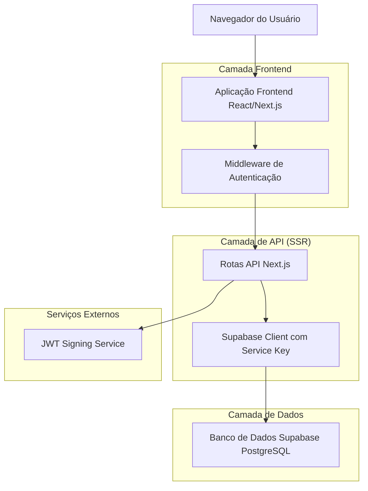
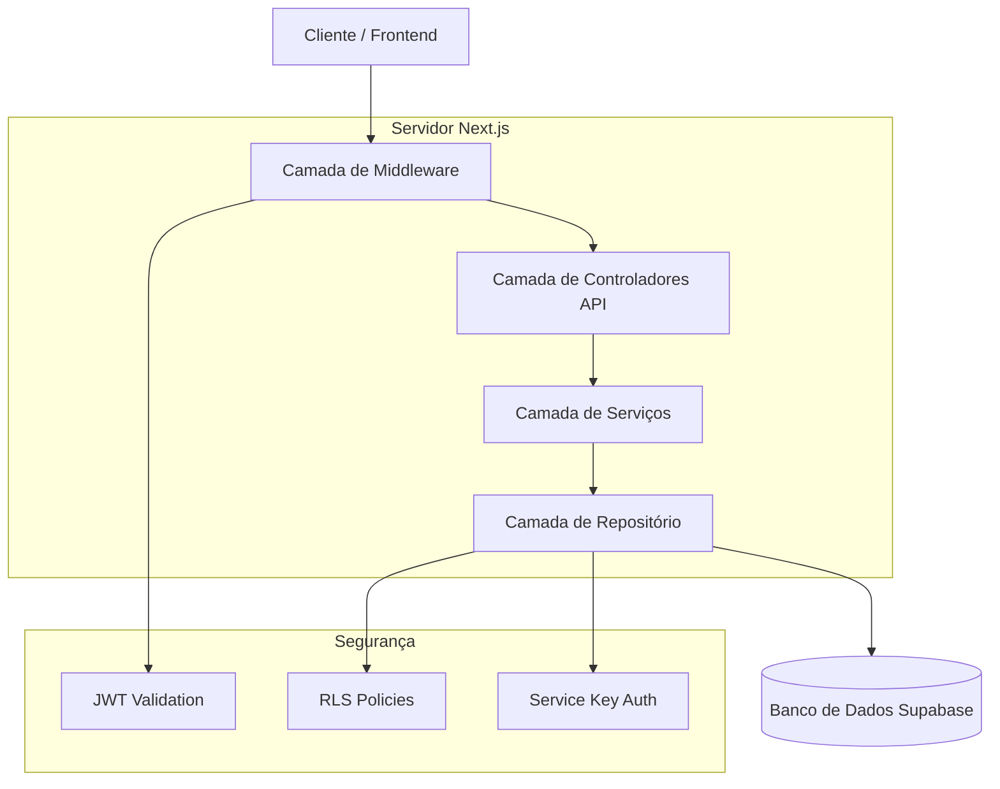
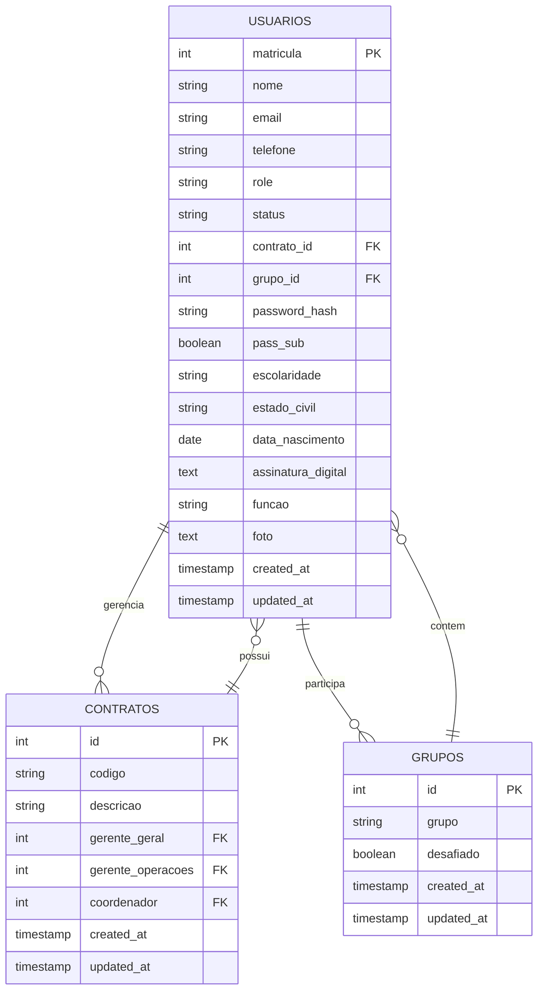

# Academia de Líderes - Documento de Arquitetura Técnica

## 1. Design da Arquitetura



## 2. Descrição das Tecnologias

* Frontend: React\@18 + Next.js\@14 + Tailwind CSS\@3 + Sonner + Lucide React

* Backend: Next.js API Routes (SSR)

* Banco de Dados: Supabase PostgreSQL

* Autenticação: JWT customizado com Supabase JWT\_SECRET

* Estilização: Tailwind CSS com tema customizado

## 3. Definições de Rotas

| Rota           | Propósito                                      |
| -------------- | ---------------------------------------------- |
| /login         | Página de autenticação com telefone e senha    |
| /dashboard     | Dashboard principal com visão geral do sistema |
| /usuarios      | Gerenciamento completo de usuários (CRUD)      |
| /grupos        | Gerenciamento de grupos e desafios             |
| /contratos     | Gerenciamento de contratos e hierarquia        |
| /perfil        | Página de perfil do usuário logado             |
| /configuracoes | Configurações do sistema e preferências        |

## 4. Definições de API

### 4.1 API Principal

**Autenticação de usuários**

```
POST /api/auth/login
```

Request:

| Nome do Parâmetro | Tipo do Parâmetro | Obrigatório | Descrição                     |
| ----------------- | ----------------- | ----------- | ----------------------------- |
| telefone          | string            | true        | Número de telefone do usuário |
| password          | string            | true        | Senha do usuário              |

Response:

| Nome do Parâmetro | Tipo do Parâmetro | Descrição                   |
| ----------------- | ----------------- | --------------------------- |
| success           | boolean           | Status da autenticação      |
| token             | string            | JWT token para autenticação |
| user              | object            | Dados básicos do usuário    |

Exemplo:

```json
{
  "telefone": "+5511999999999",
  "password": "senha123"
}
```

**Gerenciamento de usuários**

```
GET /api/usuarios
POST /api/usuarios
PUT /api/usuarios/[matricula]
DELETE /api/usuarios/[matricula]
```

**Gerenciamento de grupos**

```
GET /api/grupos
POST /api/grupos
PUT /api/grupos/[id]
DELETE /api/grupos/[id]
```

**Gerenciamento de contratos**

```
GET /api/contratos
POST /api/contratos
PUT /api/contratos/[id]
DELETE /api/contratos/[id]
```

**Perfil do usuário**

```
GET /api/perfil
PUT /api/perfil
POST /api/perfil/upload-foto
POST /api/perfil/assinatura-digital
```

## 5. Arquitetura do Servidor



## 6. Modelo de Dados

### 6.1 Definição do Modelo de Dados



### 6.2 Linguagem de Definição de Dados

**Tabela de Usuários (usuarios)**

```sql
-- Criar tabela de usuários
CREATE TABLE usuarios (
    matricula INTEGER PRIMARY KEY,
    nome VARCHAR(255) NOT NULL,
    email VARCHAR(255) UNIQUE NOT NULL,
    telefone VARCHAR(20) UNIQUE NOT NULL,
    role VARCHAR(20) DEFAULT 'usuario' CHECK (role IN ('admin', 'membro', 'usuario')),
    status VARCHAR(20) DEFAULT 'ativo' CHECK (status IN ('ativo', 'inativo')),
    contrato_id INTEGER REFERENCES contratos(id),
    grupo_id INTEGER REFERENCES grupos(id),
    password_hash VARCHAR(255) NOT NULL,
    pass_sub BOOLEAN DEFAULT FALSE,
    escolaridade VARCHAR(100),
    estado_civil VARCHAR(50),
    data_nascimento DATE,
    assinatura_digital TEXT,
    funcao VARCHAR(255),
    foto TEXT,
    created_at TIMESTAMP WITH TIME ZONE DEFAULT NOW(),
    updated_at TIMESTAMP WITH TIME ZONE DEFAULT NOW()
);

-- Criar índices
CREATE INDEX idx_usuarios_telefone ON usuarios(telefone);
CREATE INDEX idx_usuarios_email ON usuarios(email);
CREATE INDEX idx_usuarios_contrato ON usuarios(contrato_id);
CREATE INDEX idx_usuarios_grupo ON usuarios(grupo_id);

-- Políticas RLS
ALTER TABLE usuarios ENABLE ROW LEVEL SECURITY;
GRANT SELECT, INSERT, UPDATE, DELETE ON usuarios TO authenticated;
CREATE POLICY "Usuários autenticados podem acessar dados" ON usuarios FOR ALL TO authenticated USING (true);
```

**Tabela de Grupos (grupos)**

```sql
-- Criar tabela de grupos
CREATE TABLE grupos (
    id SERIAL PRIMARY KEY,
    grupo VARCHAR(255) NOT NULL UNIQUE,
    desafiado BOOLEAN DEFAULT FALSE,
    created_at TIMESTAMP WITH TIME ZONE DEFAULT NOW(),
    updated_at TIMESTAMP WITH TIME ZONE DEFAULT NOW()
);

-- Políticas RLS
ALTER TABLE grupos ENABLE ROW LEVEL SECURITY;
GRANT SELECT, INSERT, UPDATE, DELETE ON grupos TO authenticated;
CREATE POLICY "Usuários autenticados podem acessar grupos" ON grupos FOR ALL TO authenticated USING (true);
```

**Tabela de Contratos (contratos)**

```sql
-- Criar tabela de contratos
CREATE TABLE contratos (
    id SERIAL PRIMARY KEY,
    codigo VARCHAR(50) NOT NULL UNIQUE,
    descricao TEXT NOT NULL,
    gerente_geral INTEGER REFERENCES usuarios(matricula),
    gerente_operacoes INTEGER REFERENCES usuarios(matricula),
    coordenador INTEGER REFERENCES usuarios(matricula),
    created_at TIMESTAMP WITH TIME ZONE DEFAULT NOW(),
    updated_at TIMESTAMP WITH TIME ZONE DEFAULT NOW()
);

-- Criar índices
CREATE INDEX idx_contratos_codigo ON contratos(codigo);
CREATE INDEX idx_contratos_gerente_geral ON contratos(gerente_geral);
CREATE INDEX idx_contratos_gerente_operacoes ON contratos(gerente_operacoes);
CREATE INDEX idx_contratos_coordenador ON contratos(coordenador);

-- Políticas RLS
ALTER TABLE contratos ENABLE ROW LEVEL SECURITY;
GRANT SELECT, INSERT, UPDATE, DELETE ON contratos TO authenticated;
CREATE POLICY "Usuários autenticados podem acessar contratos" ON contratos FOR ALL TO authenticated USING (true);

-- Dados iniciais
INSERT INTO grupos (grupo, desafiado) VALUES 
('Grupo Alpha', true),
('Grupo Beta', false),
('Grupo Gamma', true);

INSERT INTO contratos (codigo, descricao) VALUES 
('0010A', 'Gerdau Ouro Branco'),
('0020B', 'Vale do Rio Doce'),
('0030C', 'Petrobras Santos');
```

