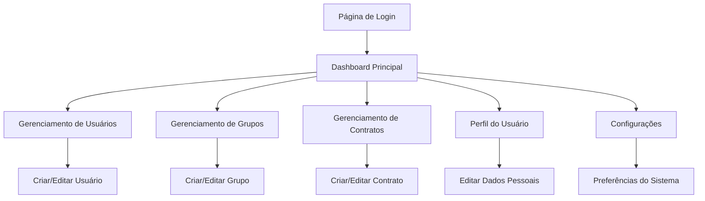

# Academia de Líderes - Documento de Requisitos do Produto

## 1. Visão Geral do Produto

A Academia de Líderes é uma plataforma web moderna para gerenciamento de desafios e treinamentos específicos de liderança. O sistema permite que organizações administrem usuários, grupos e contratos de forma eficiente, proporcionando uma experiência sofisticada e intuitiva para o desenvolvimento de líderes.

O produto resolve a necessidade de centralizar e organizar programas de treinamento de liderança, oferecendo controle granular sobre participantes, grupos de desafio e estruturas contratuais. Destina-se a empresas e organizações que investem no desenvolvimento de liderança de seus colaboradores.

## 2. Funcionalidades Principais

### 2.1 Papéis de Usuário

| Papel | Método de Registro | Permissões Principais |
|-------|-------------------|----------------------|
| Admin | Criado pelo sistema | Acesso completo: gerenciar usuários, grupos, contratos e configurações |
| Membro | Cadastrado por Admin | Pode participar de desafios, visualizar grupos e contratos atribuídos |
| Usuário | Cadastrado por Admin | Acesso básico: visualizar informações pessoais e participar de atividades |

### 2.2 Módulos de Funcionalidade

Nossa plataforma Academia de Líderes consiste nas seguintes páginas principais:

1. **Página de Login**: autenticação por telefone e senha, recuperação de senha.
2. **Dashboard Principal**: visão geral de atividades, estatísticas e navegação rápida.
3. **Gerenciamento de Usuários**: listagem, criação, edição e controle de status de usuários.
4. **Gerenciamento de Grupos**: criação e administração de grupos, controle de desafios.
5. **Gerenciamento de Contratos**: cadastro e administração de contratos com hierarquia de responsáveis.
6. **Perfil do Usuário**: visualização e edição de dados pessoais, assinatura digital.
7. **Configurações**: preferências do sistema, modo claro/escuro, configurações de conta.

### 2.3 Detalhes das Páginas

| Nome da Página | Nome do Módulo | Descrição da Funcionalidade |
|----------------|----------------|----------------------------|
| Página de Login | Autenticação | Realizar login com telefone e senha, recuperar senha, validação de credenciais |
| Dashboard Principal | Painel de Controle | Exibir estatísticas gerais, atalhos rápidos, notificações importantes |
| Gerenciamento de Usuários | CRUD de Usuários | Listar usuários com filtros, criar novos usuários, editar dados, alterar status (ativo/inativo), definir papéis |
| Gerenciamento de Grupos | CRUD de Grupos | Criar grupos, definir status de desafio, associar usuários, visualizar membros |
| Gerenciamento de Contratos | CRUD de Contratos | Cadastrar contratos com código e descrição, definir gerente geral, gerente de operações e coordenador |
| Perfil do Usuário | Dados Pessoais | Visualizar e editar informações pessoais, upload de foto, gerenciar assinatura digital, alterar senha |
| Configurações | Preferências | Alternar modo claro/escuro, configurações de notificação, preferências de sistema |

## 3. Processo Principal

### Fluxo do Administrador
O administrador acessa o sistema através da página de login, é direcionado ao dashboard onde pode visualizar estatísticas gerais. A partir do dashboard, pode navegar para o gerenciamento de usuários para criar e administrar contas, acessar o gerenciamento de grupos para organizar equipes e desafios, e utilizar o gerenciamento de contratos para estruturar a hierarquia organizacional.

### Fluxo do Usuário/Membro
O usuário realiza login e acessa o dashboard personalizado com suas informações. Pode visualizar seu perfil, editar dados pessoais quando permitido, e participar das atividades dos grupos aos quais está associado.

## 4. Design da Interface do Usuário

### 4.1 Estilo de Design

- **Cores Primárias e Secundárias**: 
  - Primária: #2B3C8D (azul corporativo)
  - Secundárias: #AB3059 (rosa), #F0AB21 (amarelo), #703670 (roxo), #EC8945 (laranja), #DE4238 (vermelho), #1780C2 (azul claro), #2E6D86 (azul escuro), #4DA669 (verde)
- **Estilo de Botões**: Bordas arredondadas com efeitos de hover suaves e micro-animações
- **Fonte e Tamanhos**: Família Montserrat, tamanhos de 12px a 32px conforme hierarquia
- **Estilo de Layout**: Design baseado em cards com navegação superior, sidebar responsiva
- **Ícones**: Lucide React para consistência visual e modernidade

### 4.2 Visão Geral do Design das Páginas

| Nome da Página | Nome do Módulo | Elementos da UI |
|----------------|----------------|-----------------|
| Página de Login | Formulário de Autenticação | Card centralizado, campos de telefone e senha, botão primário, link de recuperação, animações suaves |
| Dashboard Principal | Painel de Estatísticas | Grid de cards com métricas, gráficos interativos, navegação rápida, cores da paleta corporativa |
| Gerenciamento de Usuários | Tabela de Dados | DataTable responsiva, filtros avançados, modais para CRUD, badges de status, paginação |
| Gerenciamento de Grupos | Lista de Grupos | Cards de grupos, indicadores visuais de desafio, botões de ação, layout em grid responsivo |
| Gerenciamento de Contratos | Formulário Hierárquico | Formulários estruturados, seletores de usuários, validação em tempo real, layout em duas colunas |
| Perfil do Usuário | Dados Pessoais | Layout de perfil com foto, formulários organizados em seções, upload de arquivos, assinatura digital |
| Configurações | Painel de Preferências | Toggle switches para modo escuro, cards de configuração, salvamento automático |

### 4.3 Responsividade

O produto é desktop-first com adaptação completa para mobile. Inclui otimização para interação touch, navegação por gestos e layout adaptativo que mantém a usabilidade em todas as resoluções. O sistema utiliza breakpoints do Tailwind CSS para garantir experiência consistente em dispositivos móveis, tablets e desktops.